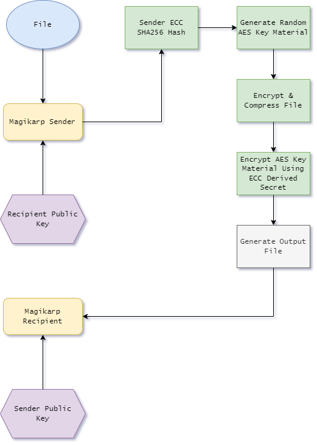
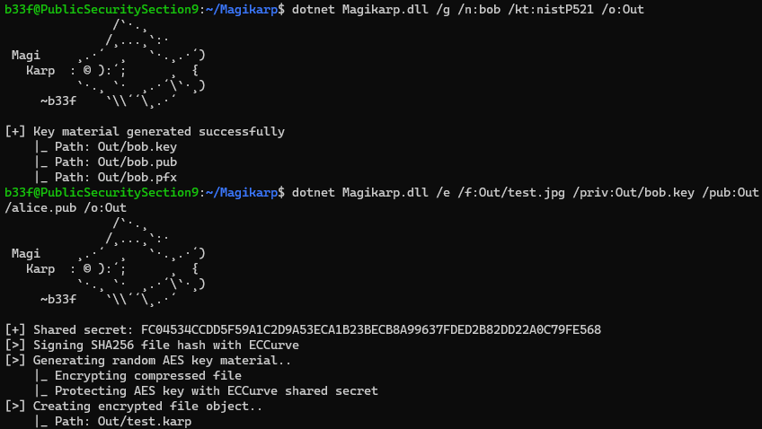
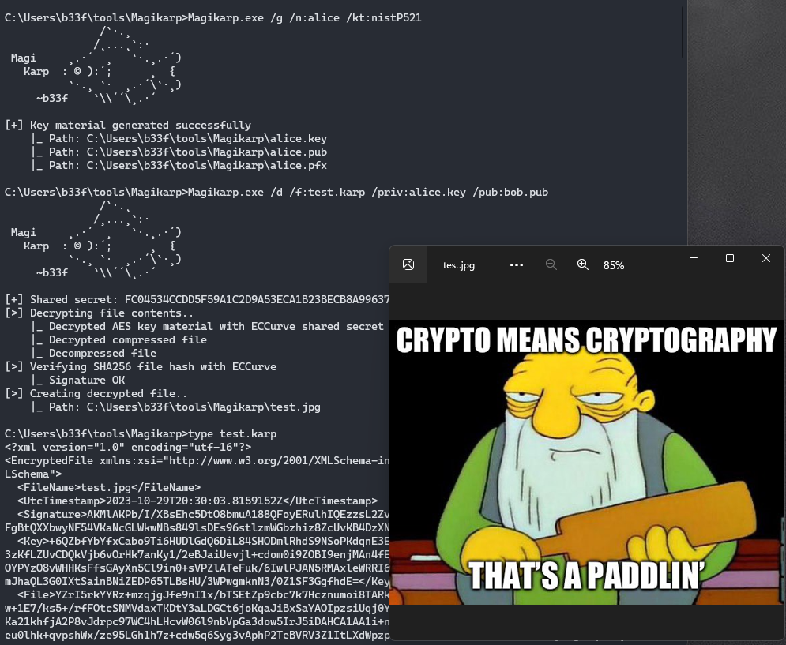

# Magikarp

`Magikarp` is a cryptographic command-line utility designed for secure file operations using `Elliptic Curve Cryptography` (ECC). It offers easy key generation and data encryption. Under the hood, `Magikarp` employs AES for symmetric encryption of the file contents, and then asymmetrically encrypts the AES key material using ECC shared secrets. A `SHA256 digital signature` is also appended for message integrity, ensuring that the data has not been tampered with during transmission. The tool is designed to be agnostic to the underlying file types it can encrypt or decrypt and supports multiple ECC curves (`nistP256`, `nistP384`, and `nistP521`). The tool is built to be compatible with both `.NET 4.7+` and `.NET 6`, offering a unified multi-platform code base.

### Implementation

You can see a basic diagram of the implementation below.



### Example

Command line usage is shown below.

```
C:\> Magikarp.exe
               /`·.¸
              /¸...¸`:·
 Magi     ¸.·´  ¸   `·.¸.·´)
   Karp  : © ):´;      ¸  {
          `·.¸ `·  ¸.·´\`·¸)
     ~b33f    `\\´´\¸.·´

Usage: Magikarp.exe [options]

/Help  (/h )           Print help text
/Generate  (/g )       Generate ECC key pair
/Encrypt  (/e )        Encrypt file
/Decrypt  (/d )        Decrypt file
/Name: (/n:)           Name of the key pair
/KeyType: (/kt:)       Key type (nistP256, nistP384, nistP521)
/File: (/f:)           File to encrypt/decrypt
/OutputFolder: (/o:)   Output folder for result file
/PublicKey: (/pub:)    Public key file of the recipient
/PrivateKey: (/priv:)  Private key file of the sender

# Generate ECC key pair in the current or specified folder
Magikarp.exe /g /n:b33f /kt:nistP256 [/o:C:\Some\Path]

# Encrypt file in the current or specified folder
Magikarp.exe /e /f:some.file /pub:bob.pub /priv:alice.key [/o:/Some/Path]

# Decrypt file in the current or specified folder
Magikarp.exe /d /f:some.file /pub:alice.pub /priv:bob.key [/o:C:\Some\Path]
```

Here `bob` creates a keypair and encrypts a file using his private key and `alice`'s public key.



Then here `alice` decrypts the file using her private key and `bob`'s public key.



### Thoughts

Mostly I implemented this out of personal curiosity. Overall, .NET documentation on ECC is ok (but not great) and I did notice that there are implementation differences between `Framework` and `.NET6` which I had to work around. I don't intend to develop this further unless there is interest but you should be aware that because I use `System.IO.File` to read and write data in full chunks that there is a hard technical limitation on the size of the file you can encrypt (`2 GB`).